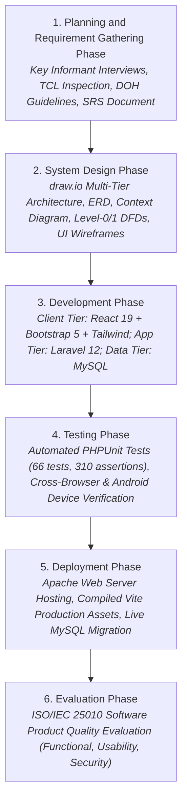
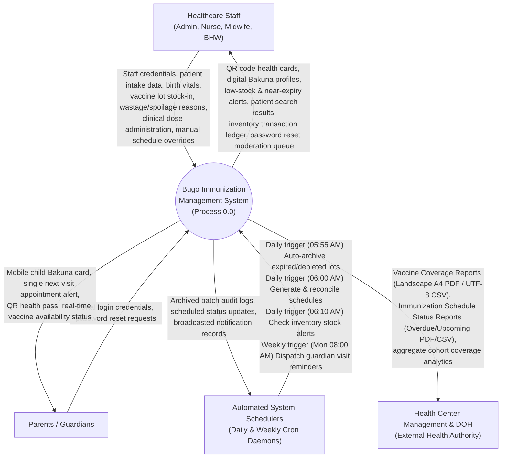
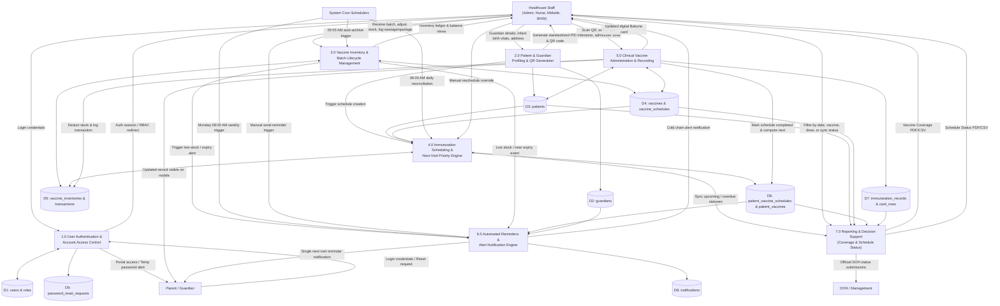
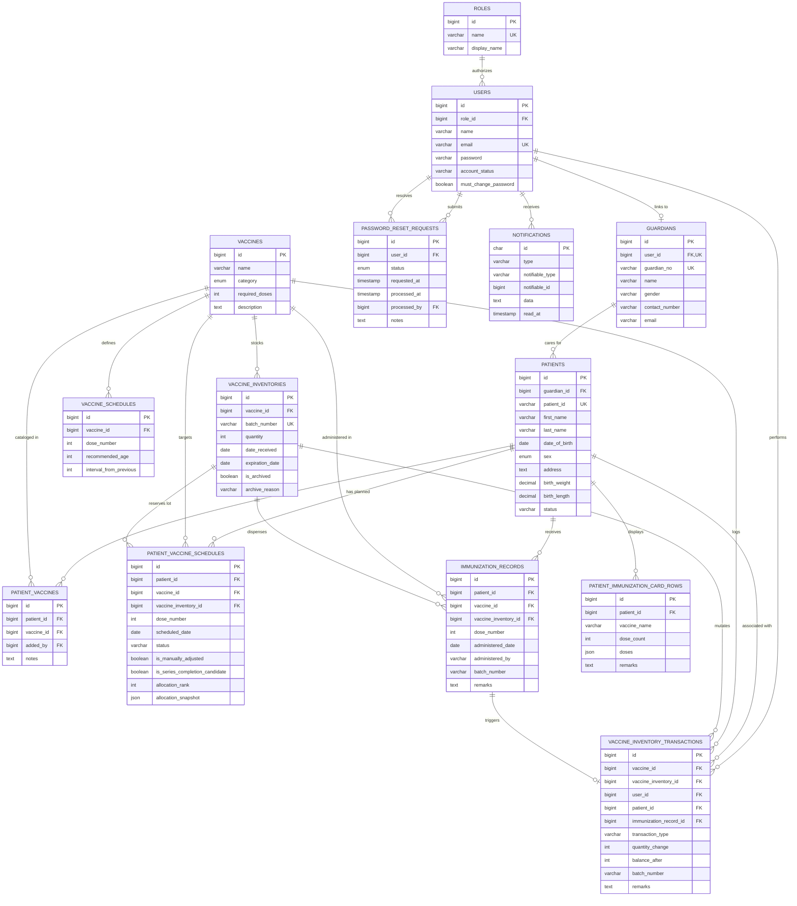
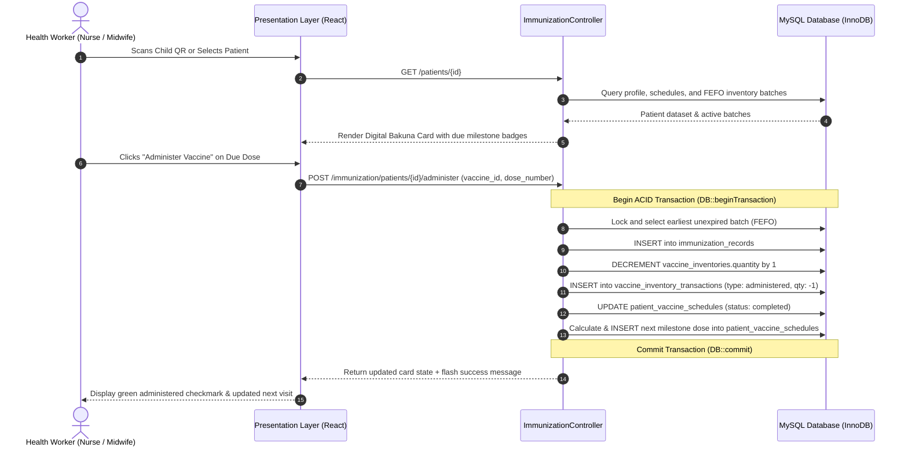
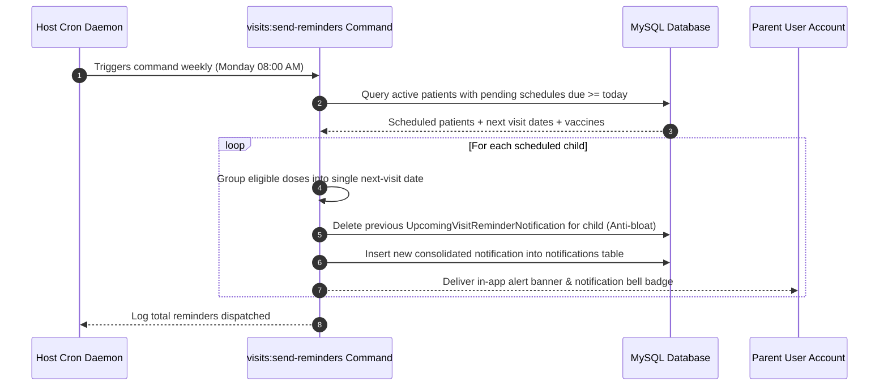
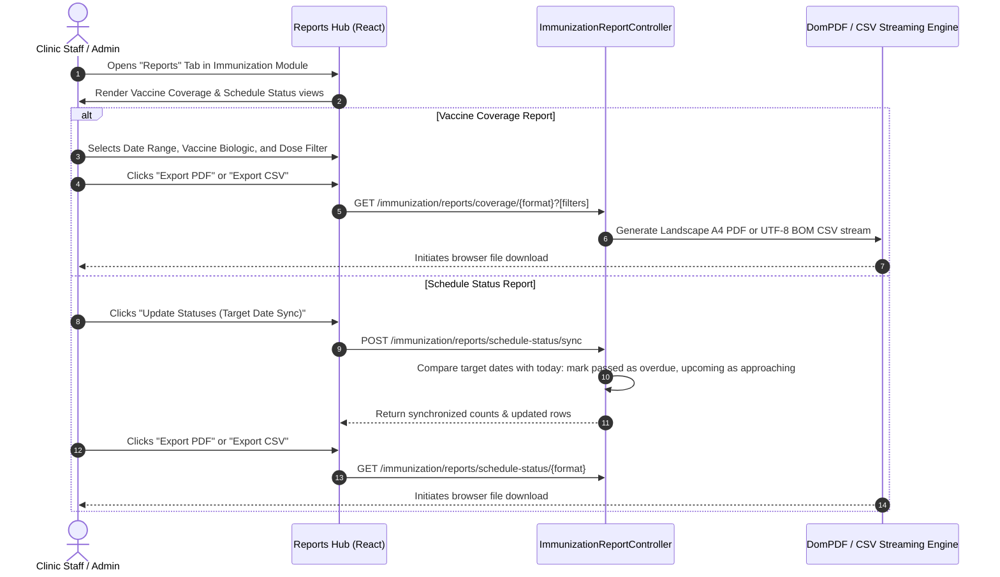

# System Conceptual Framework, DFDs, ERD & Clinical Workflows

## Web-Based Pediatric Immunization Tracking, Vaccine Inventory Management, and Automated Reminder Notification System with QR Code-Enabled Patient Record Management

* **System Identifier**: Barangay Bugo Immunization Management System (`Bugo`)  
* **Methodology**: Waterfall Model System Design Phase (Ardiansyah et al., 2022)  
* **Design & Diagramming Tool**: draw.io Architectural Modeling (JGraph Ltd, 2020)  
* **Beneficiary**: Barangay Bugo Health Center, Cagayan de Oro City, Misamis Oriental  

---

## 1. Conceptual Framework (IPO Model - Manuscript Figure 1.0)

```mermaid
flowchart LR
    subgraph INPUT["INPUT"]
        I1["Patient Demographics<br/>(Name, DOB, Birth Vitals, Purok)"]
        I2["EPI Immunization Guidelines<br/>(DOH Milestone Intervals & Doses)"]
        I3["Staff Credentials & Roles<br/>(Admin, Nurse, Midwife, BHW)"]
        I4["Vaccine Batch & Inventory Data<br/>(Lot Numbers, Expiration, Quantities)"]
        I5["Report Filter Criteria<br/>(Date Range, Vaccine Biologic, Dose)"]
    end

    subgraph PROCESS["PROCESS"]
        P1["1.0 User Authentication & RBAC Access Control"]
        P2["2.0 Patient & Guardian Profiling with QR Generation"]
        P3["3.0 Vaccine Inventory Management (FEFO & Audit Ledger)"]
        P4["4.0 Immunization Scheduling & Next-Visit Engine"]
        P5["5.0 Clinical Vaccine Administration & Dose Deduction"]
        P6["6.0 Automated Reminders & Alert Notification Engine"]
        P7["7.0 Reporting & Decision Support (Coverage & Schedule Status)"]
    end

    subgraph OUTPUT["OUTPUT"]
        O1["Patient High-Contrast QR Code & Digital Health Pass"]
        O2["Interactive Digital Child Immunization Card (Bakuna Card)"]
        O3["Vaccine Coverage Report (PDF & CSV Formats)"]
        O4["Immunization Schedule Status Report (PDF & CSV Formats)"]
        O5["Automated Weekly Monday Reminders (Single Next-Visit Alert)"]
        O6["Cold Chain Stock Alerts (Low Stock, Near Expiry, Wastage)"]
        O7["Immutable Inventory Transaction Audit Ledger"]
    end

    INPUT --> PROCESS --> OUTPUT
```

---

## 2. Research Methodology: Waterfall Model (Manuscript Figure 2.0)

---

## 3. Context Diagram (System Level-0 DFD)

The Context Diagram defines the global operational boundary of the Bugo Immunization Management System, illustrating interactions with all external human and automated entities:

---

## 4. Level-1 Data Flow Diagram (DFD Level 1)

The Level-1 DFD decomposes the system into **7 major core processes** and **9 normalized data stores**:

### 4.1 Process Decomposition & Subsystem Descriptions

1. **Process 1.0 (User Authentication & Access Control)**:
   * Handles unified login for both clinic staff and guardians via `/login`.
   * Enforces role redirection: Admin (`/dashboard`, `/staff`), Clinic Staff (`/dashboard`, `/immunization`), Guardians (`/guardian/dashboard`).
   * Enforces temporary password changes on initial login via `password.first-change`.
   * Restricts password reset requests to a single pending request per user with real-time flash alert indicators.

2. **Process 2.0 (Patient & Guardian Profiling & QR Generation)**:
   * Registers guardians with formatted number `GRD-YYYY-XXXX`.
   * Enrolls pediatric patients under guardians with formatted ID `PT-XXXXXX` and comprehensive birth anthropometrics (weight, length, head/chest circumferences, birth attendant, gestational maturity).
   * Generates high-contrast QR code encoding the unique `patient_id` for instant camera-based retrieval.

3. **Process 3.0 (Vaccine Inventory & Batch Lifecycle Management)**:
   * Tracks vaccine lots, intake dates, manufacturer, and expiration dates.
   * Enforces First-Expired, First-Out (FEFO) batch prioritization.
   * Records balance mutations in `vaccine_inventory_transactions` (`received`, `administered`, `wastage`, `spoilage`, `adjustment`, `archived`).
   * Daily 05:55 AM daemon auto-archives expired and 0-stock batches while retaining immutable transaction histories.

4. **Process 4.0 (Immunization Scheduling & Next-Visit Priority Engine)**:
   * Dynamically calculates target vaccination dates based on child birth date and DOH EPI recommended intervals.
   * Categorizes pending schedules into `Upcoming` (within approaching window) or `Overdue` (target date passed).
   * Priority Flagging Algorithm: When inventory stock drops below critical thresholds, identifies children nearing full series completion and reserves doses.

5. **Process 5.0 (Clinical Vaccine Administration & Tracking)**:
   * Health worker scans patient QR or opens profile to inspect the interactive digital Bakuna card.
   * Single-click administration commits an ACID database transaction: creates `immunization_records`, decrements `vaccine_inventories.quantity`, appends `vaccine_inventory_transactions`, marks `patient_vaccine_schedules` as `completed`, and computes the subsequent milestone schedule.

6. **Process 6.0 (Automated Reminders & Multi-Channel Notifications)**:
   * Weekly Monday 08:00 AM daemon executes `visits:send-reminders`.
   * Groups multiple eligible vaccine doses for a child into a single, consolidated next-visit reminder.
   * Anti-bloat deduplication: Automatically purges prior visit reminders for the same child to keep guardian notification inboxes clear.
   * Generates in-app notifications with read/unread tracking and priority badges.

7. **Process 7.0 (Immunization Reporting & Analytics)**:
   * **Vaccine Coverage Report**: Computes target cohort, dose completion rates (Dose 1, Dose 2, Dose 3, Boosters, Total), and child line listings; filterable by date range (`date_from`, `date_to`), vaccine biologic, and dose.
   * **Immunization Schedule Status Report**: Outlines each child's status with days elapsed/approaching; provides a 1-click status synchronization button and row-level status updater (`overdue` vs `upcoming`).
   * Dual export engines: Landscape A4 PDFs via DomPDF and RFC-4180 CSV streams with UTF-8 Byte Order Marks (BOM).

---

## 5. Entity-Relationship Diagram (ERD) - Full 14 Tables

---

## 6. Clinical Sequence & Process Flow Workflows

### 6.1 Single-Click Administration & Atomic Stock Deduction Workflow

### 6.2 Weekly Monday Reminder Dispatch Workflow

### 6.3 Vaccine Coverage & Schedule Status Report Workflow

---

## 7. UI Layout Specifications & Wireframe Mapping for Draw.io

The system analyst should model the following screen wireframes in Draw.io representing the primary clinical interfaces:

### 7.1 Desktop Workstation: Clinic Admin/Staff Layout
* **Dimensions**: 1200 x 800 px.
* **Header / Topbar**:
  * Health Center Logo, Current Module Title, Date & Time indicator.
  * Notification Bell with active unread counter badge.
  * User profile dropdown (Name, Role: Nurse/Midwife/Admin, Logout).
* **Navigation Sidebar**:
  * Dashboard (`/dashboard`)
  * Patient Management (`/patients`)
  * Immunization Tracking (`/immunization`)
  * Vaccine Inventory (`/vaccine-inventory`)
  * Vaccine Master List (`/vaccines`)
  * Staff Accounts (`/staff` - Admin only)
* **Main Content Area**: Tabbed workspace (e.g. Schedule Queue, Administer Encounter, Reports Hub).

### 7.2 Immunization Module: Reports Hub View
* **Top Controls Bar**:
  * Report Switcher Tabs: `[ Vaccine Coverage Report ]` | `[ Immunization Schedule Status Report ]`.
  * Date Pickers: `From: [ YYYY-MM-DD ]` `To: [ YYYY-MM-DD ]`.
  * Biologic Selector: `Vaccine: [ All / Pentavalent / BCG / ... ]`.
  * Dose Selector: `Dose: [ All / Dose 1 / Dose 2 / Dose 3 / Booster ]`.
  * Export Action Buttons: `[ Export PDF ]` (red) and `[ Export CSV ]` (green).
* **Vaccine Coverage Summary Cards**:
  * 4 Statistic KPI Tiles: Target Cohort (N), Total Doses Administered (N), Doses 1-3 Completed (N), Coverage Rate (%).
* **Compact Children Table**:
  * Columns: `Date`, `Patient ID`, `Child Full Name`, `Sex`, `Age Admin`, `Parent / Guardian`, `Vaccine`, `Dose`, `Batch Number`, `Administered By`, `Remarks`.
  * Highlight: Dedicated `Vaccine` and `Dose` columns for clean vertical alignment.

### 7.3 Immunization Schedule Status Report View
* **Top Controls Bar**:
  * Status Sync Action: `[ Update Statuses (Target Date Sync) ]` with instant confirmation badge.
  * Search Box: Filter by Child Name or Guardian.
  * Export Action Buttons: `[ Export PDF ]` and `[ Export CSV ]`.
* **Compact Schedule Table**:
  * Columns: `Child Name`, `Sex`, `Age`, `Parent / Guardian`, `Vaccine`, `Dose`, `Target Date`, `Timeline Status` (Overdue red badge / Upcoming green badge), `Timeline Diff` (e.g., "5 days overdue"), `Action Status Updater` (Dropdown: `Overdue` / `Upcoming`).

### 7.4 Guardian Mobile Portal Layout
* **Dimensions**: 390 x 844 px (iPhone / Android Portrait).
* **Header**: Barangay Bugo Health Pass branding with child quick-switcher tabs.
* **Child Hero Card**:
  * Child Photo placeholder, Full Name, Patient ID (`PT-XXXXXX`).
  * High-contrast QR code pass for 1-second scanning at the clinic triage desk.
* **Next Visit Alert Card**:
  * Single consolidated reminder card displaying next appointment date, due vaccines, and health center clinic schedule.
* **Digital Bakuna Card Section**:
  * Collapsible vaccine rows showing completed checkmarks, administration dates, and lot numbers.
