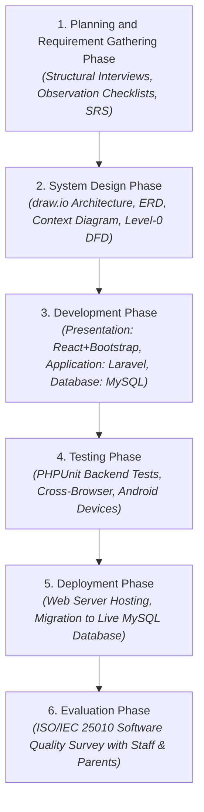
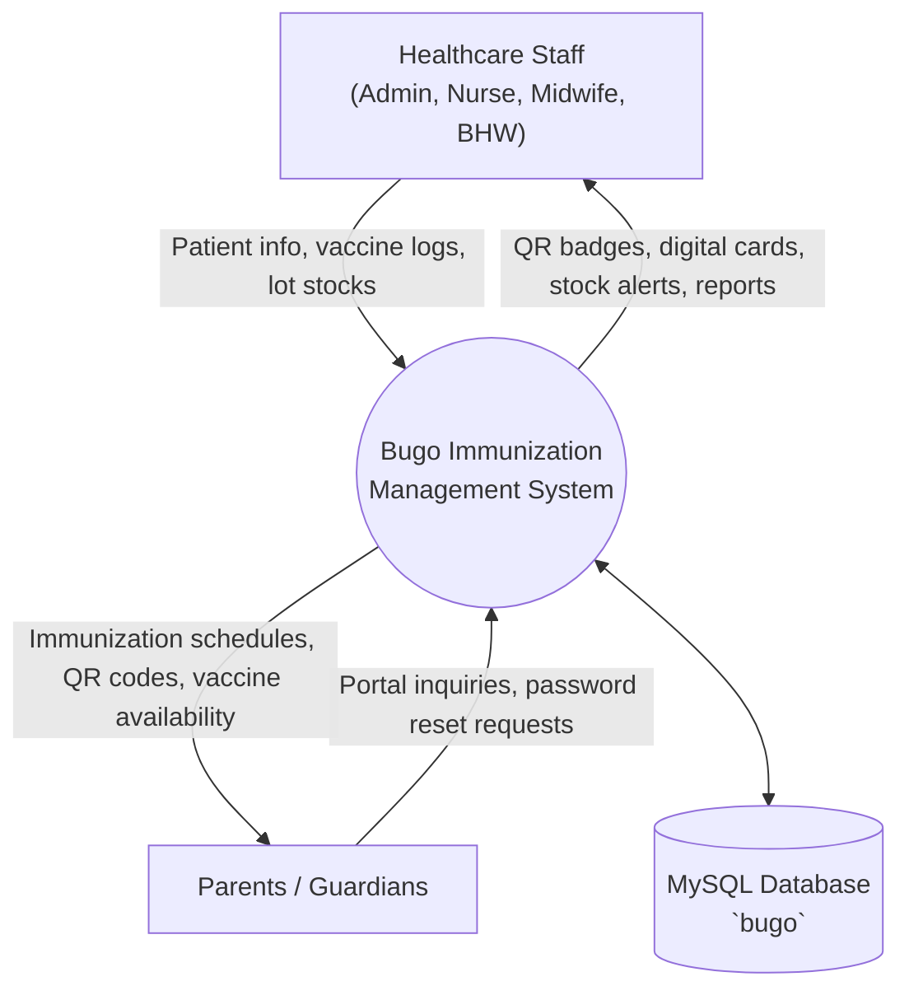
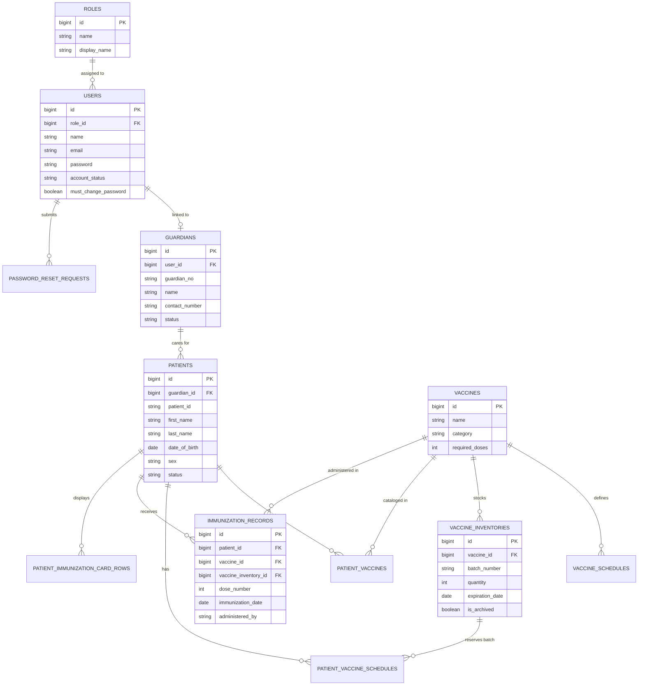
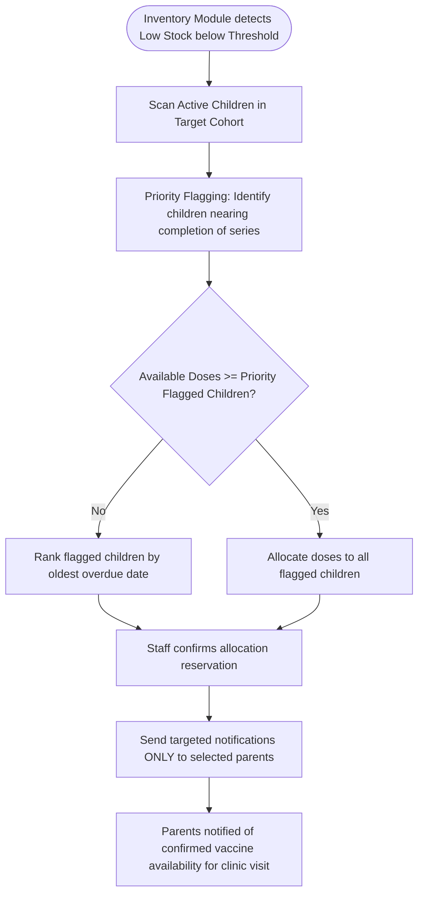
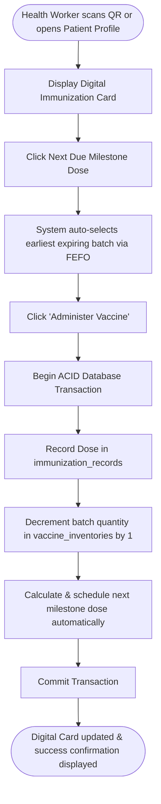

# System Conceptual Framework, ERD & Clinical Workflows

## Web-Based Pediatric Immunization Tracking, Vaccine Inventory Management, and Automated Reminder Notification System with QR Code-Enabled Patient Record Management

* **System Identifier**: Barangay Bugo Immunization Management System (`Bugo`)  
* **Methodology**: Waterfall Model (Ardiansyah et al., 2022)  
* **Diagram Standards**: Mermaid Unified Modeling & draw.io Architecture Specifications  

---

## 1. Conceptual Framework (IPO Model - Manuscript Figure 1.0)

```mermaid
flowchart LR
    subgraph INPUT["INPUT"]
        I1["Patient Details (Name, DOB, Metrics, Address)"]
        I2["Immunization Details (DOH Schedules, Intervals)"]
        I3["Staff Details (Admin, Nurse, Midwife, BHW)"]
        I4["Vaccine Inventory Details (Lots, Expiry, Thresholds)"]
    end

    subgraph PROCESS["PROCESS"]
        P1["Patient Management Module (Registration, QR Gen)"]
        P2["Vaccination Tracking Module (Administration, History)"]
        P3["Reminder & Notification Module (Priority Flagging)"]
        P4["Staff Management Module (RBAC, Audit Accounts)"]
        P5["Vaccine Inventory Module (FEFO, Low-Stock Tracking)"]
    end

    subgraph OUTPUT["OUTPUT"]
        O1["Patient QR Code & Electronic Health Card"]
        O2["Updated Vaccination Records & Milestone Dates"]
        O3["Vaccination Schedules & Coverage Reports"]
        O4["Targeted Reminder & Stock Alert Notifications"]
        O5["Low-Stock & Near-Expiry Alerts"]
        O6["Staff Account Records & Audit Logs"]
        O7["Summary Data Overview (DOH Status Reports)"]
    end

    INPUT --> PROCESS --> OUTPUT
```

---

## 2. Research Methodology: Waterfall Model (Manuscript Figure 2.0)

---

## 3. Context Diagram (Level-0 DFD)

---

## 4. Entity-Relationship Diagram (ERD)

---

## 5. Priority Flagging & Dose Allocation Workflow (Manuscript Feature)

---

## 6. Single-Click Vaccine Administration & Stock Deduction Workflow

