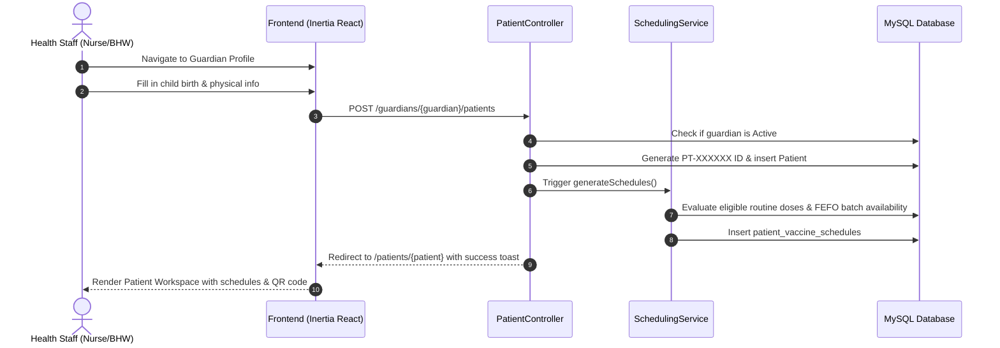
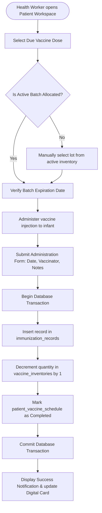
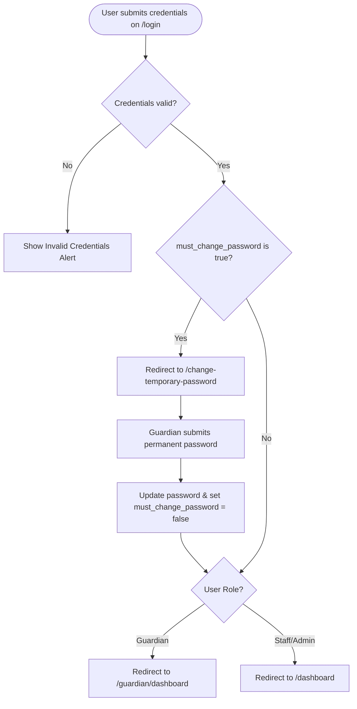

# Entity-Relationship & System Workflow Diagrams

---

## 1. Entity-Relationship Diagram (ERD)

---

## 2. Patient Registration & Child Linkage Workflow

---

## 3. Vaccine Administration & Inventory Deduction Workflow

---

## 4. Guardian Portal Login & Temporary Password Flow

